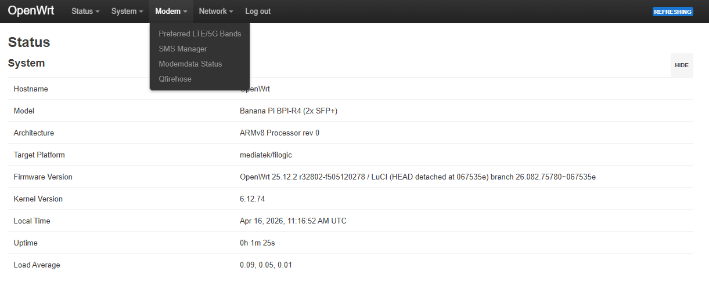
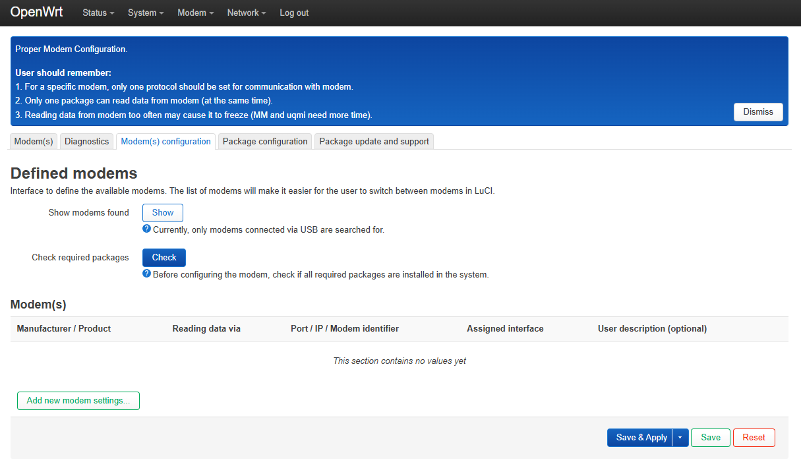
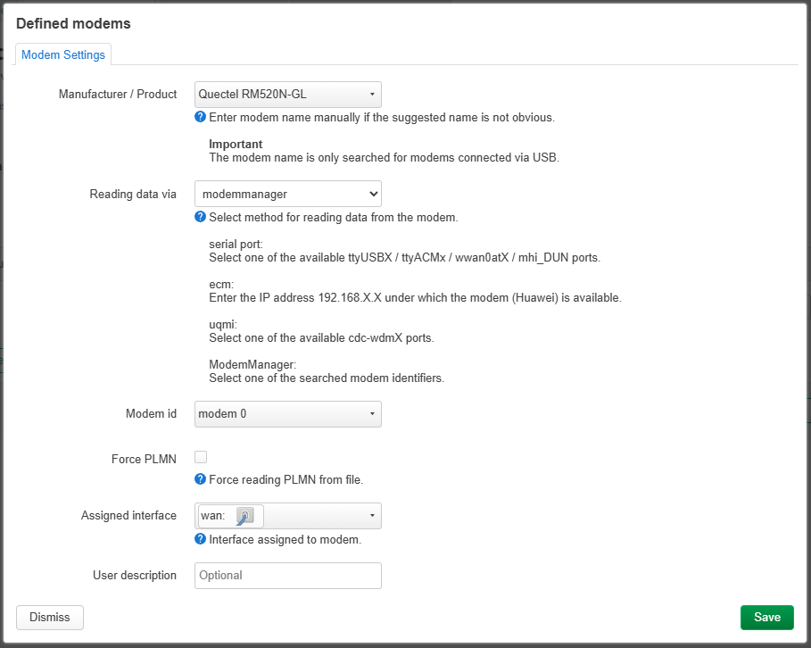
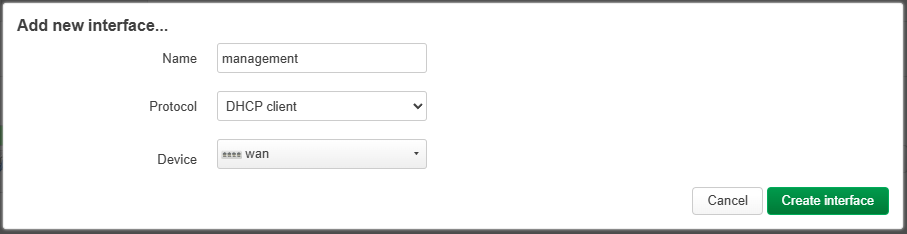
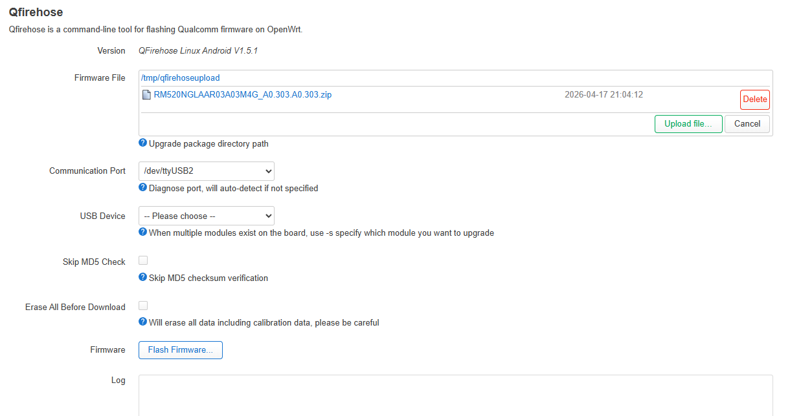

# BPIR4-with-RM520NGLAA
 A guide to setup the Banana Pi BPI-R4 with a Quectel RM520N-GLAA modem to establish a connection to the internet

The guide assumes a fresh install of OpenWRT (v25.12.2 at time of writing) on the BPI-R4 and that the RM520N-GLAA has been installed correctly.

## End Goal
By the end, we want to have a working cellular modem "box" whose main goal is to provide an internet connection to the main router of a home network.

Main steps:
1. Configure OpenWRT to communicate with the modem
2. Establish a cellular connection and map it to be the WAN interface
3. Install basic diagnostics and utilities to monitor the Bananapi and the modem
4. Create a "management" port to adjust settings of the Bananapi from another network

**Before starting, it is recommended to read ahead, note the packages you want to install and install them immediately whilst you still have a stable internet connection.**

## 1. Communicate With The Modem
Substeps:
1. If the modem is in **QMI mode**, install the following package:
    - uqmi

   If the modem is in **MBIM mode**, install the following package:
    - umbim
   
   Both packages can be installed without interfering with each other. Feel free to install both sets
   if unsure which mode your modem is currently in.

2. Install the following packages:
    - kmod-usb-serial-option
    - modemmanager
    - luci-proto-modemmanager

3. Perform reboot

4. At this point, `ls /dev` should show various `ttyUSBx` and a `cdc-wdm0`.
    - Example succesful output:
      ```
      root@OpenWrt:~# ls /dev
      bus           i2c-2         loop4         mmcblk0p4     port          ttyS1         ttyS6         ubi0_2
      cdc-wdm0      i2c-3         loop5         mmcblk0p5     ppp           ttyS10        ttyS7         ubi0_3
      console       i2c-4         loop6         mmcblk0rpmb   ptmx          ttyS11        ttyS8         ubi0_4
      fd            i2c-5         loop7         mtd0          pts           ttyS12        ttyS9         ubi0_5
      fit0          kmsg          mmcblk0       mtd0ro        random        ttyS13        ttyUSB0       ubi0_6
      fitrw         log           mmcblk0boot0  mtd1          shm           ttyS14        ttyUSB1       ubi_ctrl
      full          loop-control  mmcblk0boot1  mtd1ro        stderr        ttyS15        ttyUSB2       ubiblock0_4
      gpiochip0     loop0         mmcblk0p1     mtdblock0     stdin         ttyS2         ttyUSB3       urandom
      hwrng         loop1         mmcblk0p128   mtdblock1     stdout        ttyS3         ubi0          watchdog
      i2c-0         loop2         mmcblk0p2     null          tty           ttyS4         ubi0_0        watchdog0
      i2c-1         loop3         mmcblk0p3     pmsg0         ttyS0         ttyS5         ubi0_1        zero
      ```

## 2. Establish Cellular Connection as WAN
Substeps:
1. Delete the default `wan6` interface. IPv6 on the WAN will be handled by modemmanager.

2. Modify the `wan` interface to use `ModemManager` as the protcol:

   

3. Adjust appropriate settings. Save and apply.

   

4. At this point, OpenWRT should be using the modem as its internet source.

   If not, possibly perform a reboot. Also check system logs to see if modemmanager ran into an issue. The utilities in the next step will help to diagnose and resolve issues.

## 3. Install Diagnostics and Utilities
Substeps:
1. Add [4IceG's repository](https://github.com/4IceG/Modem-extras-apk) to opkg

2. Update opkg and install the following packages:
    - luci-app-modemband
       - Allows easy adjustment for what cellular bands the modem should search for
    - luci-app-modemdata
       - Give basic information about the current cellular connection
    - luci-app-sms-manager
       - Allows for easy sending of AT commands to the modem
    - luci-app-qfirehose
       - Allows for easy firmware updates of the Quectel modem (via qfirehose)
   
   A new `Modem` tab will appear at the top of the Luci interface:

   

3. We will now configure the packages we've just installed to communicate with the modem. 

   Under `Modem`, goto `Modemdata Status`. Upon initial setup, you should then automatically get pointed towards `Modem(s) configuration`.

   

   When clicking for "Show modems found", something like this should appear:
   ```
   [
     {
        "Manufacturer": "VIA Labs, Inc.",
        "Product": "USB Billboard Device",
        "Vendor": "2109",
        "ProdID": "8822",
        "Bus_speed": "480",
        "Serial_Number": "0000000000000001"
     },
     {
        "Manufacturer": "Quectel",
        "Product": "RM520N-GL",
        "Vendor": "2c7c",
        "ProdID": "0801",
        "Bus_speed": "5000",
        "Serial_Number": "xxxxxxxx"
     }
   ]
   ```

4. Click `Add new modem settings` and add the RM520N-GL with appropriate settings:

   

5. Under `Modem`, goto `SMS Manager`. On the `Configuration` tab, everything should be filled out. You only have to hit `Save & Apply`.

6. At the moment sending AT commands will fail with `SMS Manager`. This is due to modemmanager refusing to send AT commands without being in debug mode. If you want AT commands to work, the following steps can be followed to boot modemmanager into debug automatically at boot:
   1. Modify /etc/init.d/modemmanager so the debug flag is set:
      ```
      ....
      . /usr/share/ModemManager/modemmanager.common
      procd_open_instance "service"
      procd_set_param command /usr/sbin/ModemManager-wrapper

      # Enable debug mode for AT command usage   # Newline 1
      procd_append_param command --debug         # Newline 2

      procd_append_param command --log-level="$LOG_LEVEL"
      [ "$LOG_LEVEL" = "DEBUG" ] && procd_append_param command --debug
      [ "$LOG_LEVEL" = "DEBUG" ] && procd_append_param command --log-file "/var/log/mm.log"
      ....
      ```
   2. The debug flag forces log level to be at DEBUG on boot so we have to adjust the log level after boot to not flood the logs. Therefore we add the following line(s) to `/etc/rc.local`
      ```
      # Ensure normal logging levels due to modemmanager starting in debug mode
      mmcli -G INFO
      ```

## 4. Creating a Management Port
The management port will be used such that the Bananapi can be configured (ssh/http/... etc) from another network. Feel free to skip this step. If you don't know why it would be useful, then you probably don't need it.

There are many ways to do this. We will do this the simple way by setting up one of the Bananapi's ports to use DHCP and adjust the lan subnet range if necessary.

Substeps:
1. Select a (port) Device to use as the management interface (and remove it from any current bridge devices if necessary). 

   We will use `Switch port: "wan"` going forward. (This was the port used for the wan interface before being replaced with ModemManager).

2. Add a new firewall zone for the management port. Set both `input` and `output` to `accept`.

   

3. Add a new interface for this device and set the protcol to DHCP

   

   Under `Advanced Settings` of the new interface, uncheck the following:
    - `Use default gateway`
    - `Use DNS server advertised by peer`
   
   Under `Firewall Settings` of the new interface, assign it to the recently created `management` firewall-zone.

4. Check the subnet range of the management network the management interface will be plugged into.

   Adjust the `lan` interface to work in a different subnet. 
    - E.g if the management network operates in 192.168.1.1/24, adjust the `lan` interface to operate in 192.168.30.1/24

   Example adjustment of `lan` interface:

   

5. Now log into the Bananapi through the management interface. Add a new traffic rule to reject any traffic coming from `lan` zone going to `Device` zone on ports:
    - 22 (ssh)
    - 80 (http)
    - 443 (https)

   

## Other Things To Look Out For
Some other things to check for if the guide isn't working:
 - Ensure the modem is using sim slot 1
    - `AT+QUIMSLOT?` should output a 1
    - slot 1 is for physical sims, slot 2 is for esim?
 - Ensure sim pin detection is disabled
    - `AT+QSIMDET?` will output a 2 number tuple. First number should be 0.

## SIM Not Detected
If everything is going well then the SIM1 LED on the BPiR4 should be lit up blue and OpenWRT should have no problem detecting the SIM card.

After swapping around SIM cards I've found it is very easy for the BPiR4 to not power up the SIM1 slot (i.e the LED stays off).

My solution is to do a proper cold boot of the device.
 - Completely unplug it from power. Wait a few seconds and plug it back in.
 - Doing a software reboot (from OpenWRT) doesn't seem to have the same effect

## Basic Checks
 - Check usbspeed
    - `AT+QCFG="usbspeed"`
 - Check data protocol
    - `AT+QCFG="usbnet"`
 - Check sleep mode
    - `AT+QSCLK?`
 - Check band information
    - `AT+QENG="servingcell"`
    - `AT+QNWCFG=?`
    - `AT+QNWPREFCFG="lte_band"`
    - `AT+QNWPREFCFG="nsa_nr5g_band"`

## AT Commands Not In Manual
There are many AT commands not specified in the manual.

Some useful hidden commands are given by the AT command: `AT+QNWCFG=?`.
 - Output
   ```
   +QNWCFG: "lte_cdrx",(0,1),(0,1)
   +QNWCFG: "nr5g_cdrx",(0,1)
   +QNWCFG: "csi_ctrl",(0,1),(0,1)
   +QNWCFG: "lte_csi"
   +QNWCFG: "nr5g_csi"
   +QNWCFG: "lte_cell_id"
   +QNWCFG: "nr5g_cell_id"
   +QNWCFG: "lte_csi_ext",(0,1)
   +QNWCFG: "nr5g_csi_ext",(0,1)
   +QNWCFG: "lte_tx_pwr",(0,1)
   +QNWCFG: "nr5g_tx_pwr",(0,1)
   +QNWCFG: "wcdma_cqi"
   +QNWCFG: "up/down",(1-60)
   +QNWCFG: "data_path",(0,1)
   +QNWCFG: "dss_enable",(0,1)
   +QNWCFG: "lte_dl_tx_mode"
   +QNWCFG: "nr5g_ulMCS",(0,1)
   +QNWCFG: "nr5g_dlMCS",(0,1)
   +QNWCFG: "nr5g_pusch_data",(0,1)
   +QNWCFG: "lapi",(0,1)
   +QNWCFG: "nr5g_meas_info",(0,1)
   +QNWCFG: "lte_time_advance",(0,1)
   +QNWCFG: "nr5g_time_advance",(0,1)
   +QNWCFG: "clr_rplmn"
   +QNWCFG: "dis_rplmnact",(0,1)
   +QNWCFG: "lte_ambr"
   +QNWCFG: "nr5g_ambr"
   +QNWCFG: "disable_lte_ca",(0,1)
   +QNWCFG: "disable_nr_ca",(0,1)
   +QNWCFG: "dis_4mimo_enable",(0,1)
   +QNWCFG: "nr5g_4mimo_enable",(0,1)
   +QNWCFG: "nr5g_ulTBsize",(0,1),(1-100)
   +QNWCFG: "encryp_alg_support"
   +QNWCFG: "integ_alg_support"
   +QNWCFG: "data_roaming",(0,1)
   +QNWCFG: "nr5g_earfcn_lock",(0-32),<EARFCN_list>
   +QNWCFG: "lte_earfcn_lock",(0-2),<EARFCN_list>
   +QNWCFG: "event_a3_offset",(0,1),(0-255)
   +QNWCFG: "used_algo",(0,1)
   +QNWCFG: "nr5g_pref_freq_list",(0-32),<EARFCN_list>
   +QNWCFG: "lte_pref_freq_list",(0-32),<EARFCN_list>
   +QNWCFG: "ehplmn_config",(0-20),<ehplmn_list>
   +QNWCFG: "nr5g_mimo",(0,1)
   +QNWCFG: "ctrl_plane_dly",(0,1)
   +QNWCFG: "rrc_state",(0,1)
   +QNWCFG: "ssb_beam_id",(0,1)
   +QNWCFG: "ul_data_path",(0,1)
   +QNWCFG: "lte_ulMCS",(0,1)
   +QNWCFG: "lte_mimo_layers"
   +QNWCFG: "nr5g_mimo_layers",(0,1)
   +QNWCFG: "wcdma_tx_power"
   +QNWCFG: "lte_band_priority",<bands>
   +QNWCFG: "nr5g_band_priority",<bands>
   +QNWCFG: "cause7_map_cause14",(0,1)
   +QNWCFG: "nr5g_ul_256qam",<enable_fr1>,<enable_fr2>
   +QNWCFG: "msearch_bscan_sep",(0-500)
   +QNWCFG: "thin_ui_cfg",(0,1)
   +QNWCFG: "lte_pco",(0-2)
   +QNWCFG: "freq_info",(0,1)
   +QNWCFG: "msisdn",<mode>
   +QNWCFG: "lte_fgi_fdd",<FGI_FDD>
   +QNWCFG: "lte_fgi_tdd",<FGI_TDD>
   +QNWCFG: "sysmode"
   +QNWCFG: "nr5g_ulbw",(0,2)
   +QNWCFG: "cops_auto_mode",(0,1)
   +QNWCFG: "nitz_ons"
   +QNWCFG: "clr_guti"
   +QNWCFG: "nr5g_mimo_info"
   +QNWCFG: "lte_mimo_info"
   +QNWCFG: "3gpp_rel",<lte_rel>,<nr5g_rel>
   +QNWCFG: "nr5g_pathloss",(0,1)
   +QNWCFG: "center_arfcn_info"
   ```
 - If setting values with these commands seem to do nothing, try updating the modem firmware

## Resources
Online guides/forums/manuals used:
 - https://openwrt.org/docs/guide-user/network/wan/wwan/ltedongle
    - General cellular setup
 - https://ten64doc.traverse.com.au/applications/cellular/
    - Setting WAN interface to be the modem
 - https://forum.openwrt.org/t/looking-for-a-guide-on-configuring-lte-band-aggregation/186063
    - Setting cellular band preferences
 - https://forum.openwrt.org/t/luci-app-luci-app-3ginfo-3ginfo-gui-info-about-3g-lte-connection/67893
    - Displaying cellular signal metrics
 - https://forums.quectel.com/uploads/short-url/x7O7XpZA1jJboG9xct7VxaeWLXx.pdf
    - RM520N-GL AT Command Manual
 - https://forum.openwrt.org/t/flash-quectel-5g-4g-modem-m-2/219965/12
    - qfirehose installation through apk

Repos/packages:
 - https://github.com/4IceG/Modem-extras-apk
    - 4IceG's repo
 - https://forums.quectel.com/t/rm502q-ae-band-preference-command/15630/8
    - Hidden band prioritisation commands
 - https://github.com/gSpotx2f/luci-app-cpu-status-mini
    - luci-app-cpu-status-mini
 - https://github.com/4IceG/luci-app-modemband
    - luci-app-modemband
 - https://github.com/4IceG/luci-app-modemdata
    - luci-app-modemdata
 - https://github.com/4IceG/luci-app-sms-manager
    - luci-app-sms-manager
 - https://github.com/4IceG/luci-app-qfirehose
    - luci-app-qfirehose

## Updating Modem Firmware
Use the following AT command to check the modem's firmware version:
 - `AT+CGMR`

Assuming that the luci-app-qfirehose was installed as shown previously, then the steps to follow are:
1. Download latest firmware zip from [4IceG's repo](https://github.com/4IceG/RM520N-GL)
2. The qfirehose utility won't work properly while modemmanager is active. Go to `System` then `Startup` and stop `modemmanager`.
3. Go to `Modem` then `Qfirehose`. Upload your zip file and set the communication port to `/dev/ttyUSB2`

   
4. Finally hit `Flash Firmware`
    - Note that you may get a failure with logs showing that unzip could not find the file. ssh in and manually perform the unzip in the qfirehoseupload directory. Then try flash the firmware again.

## A Sour Note on RM520N-GLAP
If step 1 of the guide seems to not work, you may have ended up purchasing a **RM520N-GLAP** instead of the **RM520N-GLAA**.
 - The AP version does not have USB communication support whereas the AA version does
 - Product listing for the modem is frequently abreviated to **RM520N-GL** so double-check the listing details for the variant

I burnt a few days trying to get the AP version to work with no success. I eventually folded and purchased the AA version.

Incase anyone finds this helpful, here were my findings:
 - Install the `mhi-pci-generic` package. This gets the drivers for communication to the modem. Output of `lspci -v` should look like:
   ```
   root@OpenWrt:~# lspci -v
   ...
   ...

   0003:01:00.0 Unassigned class [ff00]: Qualcomm Technologies, Inc Device 0308
         Subsystem: Qualcomm Technologies, Inc Device 0308
         Flags: bus master, fast devsel, latency 0, IRQ 123
         Memory at 20200000 (64-bit, non-prefetchable) [size=4K]
         Memory at 20201000 (64-bit, non-prefetchable) [size=4K]
         Capabilities: [40] Power Management version 3
         Capabilities: [50] MSI: Enable+ Count=8/32 Maskable+ 64bit+
         Capabilities: [70] Express Endpoint, IntMsgNum 0
         Capabilities: [100] Advanced Error Reporting
         Capabilities: [148] Secondary PCI Express
         Capabilities: [168] Physical Layer 16.0 GT/s <?>
         Capabilities: [18c] Lane Margining at the Receiver
         Capabilities: [19c] Transaction Processing Hints
         Capabilities: [228] Latency Tolerance Reporting
         Capabilities: [230] L1 PM Substates
         Capabilities: [240] Data Link Feature <?>
         Kernel driver in use: mhi-pci-generic
   ```
 - The following packages are needed for modemmanager to interface with the modem:
    - kmod-mhi-net
    - kmod-mhi-wwan-ctrl
    - kmod-mhi-wwan-mbim

 - Use the [GFriend Custom OpenWRT Image](https://github.com/mdsdtech/GFriendWRT/releases/tag/V060225-R4) as a tool for sending AT commands
   
   Preview:

   

From these I was able to get a `wwan0mbim0`, `wwan0qcdm0` and `wwan0qmi0` to appear in the output of `ls /dev/`.

I think I was also able to get the modem to successfully establish a cellular connection. Some of my system logs were:
```
Fri Apr 25 03:56:16 2025 daemon.info [2736]: <inf> [modem0] processing user request to register modem...
Fri Apr 25 03:56:16 2025 daemon.info [2736]: <inf> [modem0] already registered automatically in network '....', automatic registration not launched...
Fri Apr 25 03:56:16 2025 daemon.info [2736]: <inf> [modem0] modem registered
Fri Apr 25 03:56:16 2025 daemon.notice netifd: wan (5402): successfully registered the modem
Fri Apr 25 03:56:16 2025 daemon.notice netifd: wan (5402): starting connection with apn '....'...
Fri Apr 25 03:56:16 2025 daemon.info [2736]: <inf> [modem0] processing user request to connect modem...
Fri Apr 25 03:56:16 2025 daemon.info [2736]: <inf> [modem0]   apn: ....
Fri Apr 25 03:56:16 2025 daemon.info [2736]: <inf> [modem0]   ip type: ipv4v6
Fri Apr 25 03:56:16 2025 daemon.info [2736]: <inf> [modem0]   allowed auth: unknown
Fri Apr 25 03:56:16 2025 daemon.info [2736]: <inf> [modem0]   allow roaming: yes
Fri Apr 25 03:56:16 2025 daemon.notice [2736]: <msg> [modem0] simple connect started...
Fri Apr 25 03:56:16 2025 daemon.notice [2736]: <msg> [modem0] simple connect state (6/10): register
Fri Apr 25 03:56:16 2025 daemon.info [2736]: <inf> [modem0] already registered automatically in network '....', automatic registration not launched...
Fri Apr 25 03:56:16 2025 daemon.notice [2736]: <msg> [modem0] simple connect state (7/10): wait to get packet service state attached
Fri Apr 25 03:56:16 2025 daemon.notice [2736]: <msg> [modem0] simple connect state (8/10): bearer
Fri Apr 25 03:56:16 2025 daemon.notice [2736]: <msg> [modem0] simple connect state (9/10): connect
Fri Apr 25 03:56:16 2025 daemon.notice [2736]: <msg> [modem0] state changed (registered -> connecting)
Fri Apr 25 03:56:16 2025 daemon.notice [2736]: <msg> [modem0] state changed (connecting -> connected)
Fri Apr 25 03:56:16 2025 daemon.notice [2736]: <msg> [modem0] simple connect state (10/10): all done
Fri Apr 25 03:56:16 2025 daemon.notice netifd: wan (5402): successfully connected the modem
Fri Apr 25 03:56:16 2025 daemon.notice netifd: wan (5402): signal refresh rate is not set
Fri Apr 25 03:56:16 2025 daemon.notice netifd: wan (5402): network operator name: ....
Fri Apr 25 03:56:16 2025 daemon.notice netifd: wan (5402): network operator MCCMNC: ....
Fri Apr 25 03:56:16 2025 daemon.notice netifd: wan (5402): registration type: home
Fri Apr 25 03:56:16 2025 daemon.notice netifd: wan (5402): access technology: lte, 5gnr
Fri Apr 25 03:56:16 2025 daemon.notice netifd: wan (5402): signal quality: 30%
Fri Apr 25 03:56:16 2025 daemon.notice netifd: wan (5402): IPv4 connection setup required in interface wan: static
Fri Apr 25 03:56:16 2025 daemon.notice netifd: wan (5402): adding IPv4 address ...., netmask 255.255.255.252
Fri Apr 25 03:56:16 2025 daemon.notice netifd: wan (5402): adding default IPv4 route via ....
Fri Apr 25 03:56:16 2025 daemon.notice netifd: wan (5402): adding primary DNS at ....
Fri Apr 25 03:56:16 2025 daemon.notice netifd: wan (5402): adding secondary DNS at ....
Fri Apr 25 03:56:16 2025 daemon.notice netifd: Interface 'wan' is now up
Fri Apr 25 03:56:16 2025 daemon.notice netifd: Network device 'mhi_hwip0' link is up
```

However, ModemManager never seemed to receive any packets:


Potentially useful resources:
 - https://openwrt.org/inbox/toh/sinovoip/bananapi_bpi-r4
 - https://github.com/4IceG/RM520N-GL?tab=readme-ov-file
 - https://forum.banana-pi.org/t/bpi-r4-how-to-activate-key-b-pcie2-11280000-solved/17295?page=2
 - https://forum.banana-pi.org/t/banana-pi-bpi-r4-4g-5g-module-sim-card-missing-in-modem-manager/17944/16
    - https://github.com/mdsdtech/GFriendWRT/releases/tag/V060225-R4
 - https://forum.openwrt.org/t/send-at-command-while-using-modemmanager/196440
 - https://openwrt.org/docs/guide-user/network/wan/wwan/ltedongle
 - https://forum.gl-inet.com/t/how-to-installing-vanilla-openwrt-on-gl-x3000/45404/73?page=4
    - https://forum.openwrt.org/t/need-help-rm520ngl-ap-openwrt-and-cellular-connectivity/207460
